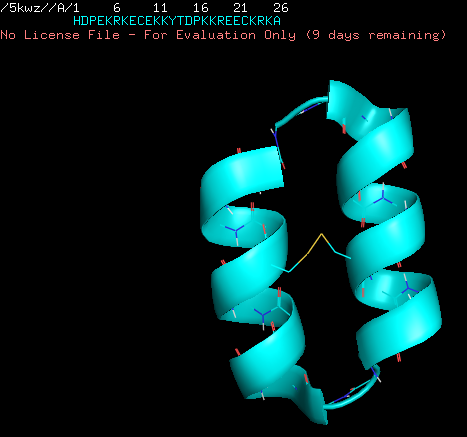
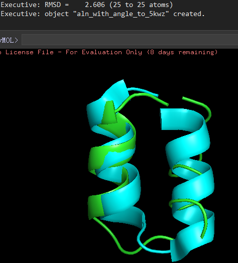

# Rosetta - Simple Cycpep Predict
参考文献：[Accurate de novo design of hyperstable constrained peptides](https://www.nature.com/articles/nature19791#accession-codes)\
官方文档：[simple cycpep predict](https://www.rosettacommons.org/docs/latest/structure_prediction/simple_cycpep_predict#description)


由来：由于基于片段的方法（Rosetta ab initio）不太适合预测具有大量D-氨基酸含量的结构，例如 NC_cH L H R _D1，因此作者们开发了一种新的无片段算法（基于GenKIC）来验证这些拓扑结构（也就是simple cycpep predict）。
一般用于头尾相连环肽的结构设计，也可以设计包含二硫键的头尾相连的环肽。

对于我们来说：这个应用如果只给定序列，不给其他约束条件或者是非头尾相连的环肽，结果会很不理想。在106个测试环肽中只有31个与原结构的主链RMSD是小于3.5Å，且序列长度越长差异越大。\
所以如果需要使用该应用对环肽结构预测，最好提供更多约束条件，比如最小氢键数、主链二面角角度、成环方式、二硫键个数等等。


# 数据准备
## 序列输入数据
将序列数据以txt的形式保存，txt中仅存放以3-4个字符的氨基酸序列。\
以"1a1p.A"为例，序列文件为 1a1p.txt，其中内容为 “`ILE CYS VAL VAL GLN ASP TRP GLY HIS HIS ARG CYS THR`”。


## 原始结构数据
如果需要直接将预测的结构数据与原始结构数据进行对比，还需要准备对应的pdb文件。


# 运行命令
## 单进程命令说明
### 测试
直接运行，用于测试\
新建 1a1p.txt，写入 `ILE CYS VAL VAL GLN ASP TRP GLY HIS HIS ARG CYS THR`\
命令行写入：
```console
simple_cycpep_predict.default.linuxgccrelease \
-cyclic_peptide:sequence_file 1a1p.txt \
-cyclic_peptide:genkic_closure_attempts 100 \
-nstruct 100 \
-mute all -unmute protocols.cyclic_peptide_predict.SimpleCycpepPredictApplication \
-out:file:silent output.silent
```
得到预测文件output.silent，然后输入提取命令：
```console
extract_pdbs.default.linuxgccrelease -in::file::silent output.silent
```
得到自动命名的pdb文件。

### 参数说明
常用参数\
`simple_cycpep_predict.default.linuxgccrelease` 启动单进程simple cycpep predict命令。\
`-cyclic_peptide:sequence_file 1a1p.txt`  输入待预测的序列txt文件。\

`-cyclic_peptide:genkic_closure_attempts 1000` 对于每个尝试的结构，应用程序应该尝试多少次以找到一个封闭的构象。默认为10,000次。根据肽的情况，从250到50,000的值都是合理的。\
`-cyclic_peptide:genkic_min_solution_count 2` 对于每个尝试的结构，应用程序将继续寻找封闭的解决方案，直到达到genkic_closure_attempts或找到这个数量的解决方案。它将从所找到的集合中挑选能量最低的解决方案。默认值为1（一旦找到一个解决方案，就立即取走）。\
`-nstruct 1000` 尝试生成的结构数量。

`-cyclic_peptide:min_genkic_hbonds 2` 初步考虑的闭合解必须具备的最小主链氢键数。默认为3。如果设置为0，则不应用氢键标准。\
`-cyclic_peptide:final_genkic_hbonds 2` 最终的闭合方案在松弛后，必须具有的最小主链氢键数。默认值为0。

`-symmetric_gly_tables true -beta_nov16` 当序列中存在D/L混合氨基酸，那么建议启用该参数，并且使用beta_nov16对称的评分函数。\
`-cyclic_peptide:cyclization_type "n_to_c_amide_bond"` 成环类型，默认是建立一个末端酰胺键。可以通过修改引号内的字符串更改成环类型。类型还包括：`terminal_disulfide` （通过一个侧链二硫化物是线性肽环化）、`thioether_lariat`（通过一个半胱氨酸SG和N端乙酰基的α碳共轭使线性肽环化）、`nterm_isopeptide_lariat`（异肽N-末端连接）、`cterm_isopeptide_lariat`（异肽C-末端连接线）、`sidechain_isopeptide`（侧链相连）。其中`terminal_disulfide`是通过二硫化物链接最近接近N端和C端的两个二硫化物形成的残基来进行的，通常可以配合下面的`-cyclic_peptide:require_disulfides true`命令一起使用，这样的话不在两端的二硫化物形成的残基之间的二硫化物组合也会被考虑。`terminal_disulfide`与环形排列、准对称采样不兼容。\
`-cyclic_peptide:cyclic_permutations true` 如果为真（默认设置），那么将使用序列的随机循环排列来避免由切点选择引入的偏差。(例如，如果用户提供了 "ALA LYS PHE ASP DILE PRO"，那么我们可能会对第一个结构尝试 "PHE ASP DILE PRO ALA LYS"，对第二个结构尝试 "DILE PRO ALA LYS PHE ASP"，等等）所有的结构在最终输出前都被去伪存真以便于对齐。
`-cyclic_peptide:require_disulfides true` 如果为真，那么应用程序会尝试在所有可以形成二硫键的残基之间形成二硫键，使用TryDisulfPermutations移动器尝试排列组合。默认情况为False。

`-cyclic_peptide:fast_relax_rounds 5` 在调用松弛协议的步骤中，这是将应用FastRelax协议的轮数。默认为3。FastRelax通过执行多轮打包和最小化来找到靠近起始构象的低能量主链和侧链构象，评分函数中的排斥权重从非常低的值逐渐增加到下一轮的正常值。\
`-cyclic_peptide:rama_cutoff 2.0` 如果use_rama_filter选项为true（默认），那么拉马钱德兰分数高于该值的枢轴残基的解决方案将被丢弃。默认值为0.8。\
`-cyclic_peptide:user_set_alpha_dihedrals 9 -61 -41 180 16 61 41 180` 用户可以将某些主链二面体固定在用户指定的数值上。这个标志后面必须跟一个由四个数字组成的列表，其中第一个数字代表一个序列位置，第二、第三和第四个数字分别是phi、psi和omega值。如果不指定则不使用。**注意**，这只适用于α-氨基酸和肽类。
`-cyclic_peptide:user_set_alpha_dihedral_perturbation 5.0` 如果使用user_set_alpha_dihedrals选项，这是一个小的高斯扰动添加到所有被设置的二面角。默认为0。

`-mute all` 不输出任何信息。\
`-unmute protocols.cyclic_peptide_predict.SimpleCycpepPredictApplication` 输出与simple cycpep predict有关的信息。

`-in:file:native 1a1p.pdb` 如果需要直接得到与原始结构的RMSD，则可以将原始pdb文件作为输入\
`-out:file:silent output.silent` 输出silent文件，如果需要直接输出pdb，可以修改成 `-out:file:o output.pdb`


## 运行sample
以5kwz.pdb为例\
\
单线程运行以下命令能得到较好地结果：
```console
simple_cycpep_predict.default.linuxgccrelease \
-out:file:silent out01.silent \
-cyclic_peptide:sequence_file 5kwz.txt \
-symmetric_gly_tables true -beta_nov16 \
-in:file:native 5kwz.pdb \
-cyclic_peptide:genkic_closure_attempts 50 \
-cyclic_peptide:genkic_min_solution_count 1 \
-cyclic_peptide:require_disulfides true \
-cyclic_peptide:disulf_cutoff_prerelax 2000 \
-cyclic_peptide:min_genkic_hbonds 14 \
-cyclic_peptide:min_final_hbonds 14 \
-cyclic_peptide:fast_relax_rounds 5 \
-cyclic_peptide:rama_cutoff 2.0 \
-mute all -unmute protocols.cyclic_peptide_predict.SimpleCycpepPredictApplication \
-nstruct 100 \
-cyclic_peptide:user_set_alpha_dihedrals  3 -61 -41 180 4 -61 -41 180 5 -61 -41 180 6 -61 -41 180 7 -61 -41 180 8 -61 -41 180 9 -61 -41 180 16 61 41 180 17 61 41 180 18 61 41 180 19 61 41 180 20 61 41 180 21 61 41 180 22 61 41 180 23 61 41 180 \
-cyclic_peptide:user_set_alpha_dihedral_perturbation 5.0
```
结果：\


## 多进程命令说明
### 测试
命令行写入：
```console
mpirun -np 20 simple_cycpep_predict.mpi.linuxgccrelease \
-cyclic_peptide:sequence_file 1a1p.A.txt \
-nstruct 150 \
-cyclic_peptide:genkic_closure_attempts 1000 \ -cyclic_peptide:genkic_min_solution_count 3 \
-cyclic_peptide:cyclization_type "terminal_disulfide"\
-cyclic_peptide:MPI_auto_2level_distribution \
-cyclic_peptide:MPI_batchsize_by_level 125 \
-cyclic_peptide:compute_pnear_to_this_fract 1.0 \
-cyclic_peptide:MPI_pnear_lambda 1.0 \
-cyclic_peptide:MPI_pnear_kbt 0.62 \
-min_genkic_hbonds 0 \
-min_final_hbonds 0 \
-mute all -unmute protocols.cyclic_peptide_predict.SimpleCycpepPredictApplication_MPI_summary \
-out:file:silent result/1a1p.A.silent;
```
得到预测文件output.silent，然后输入提取命令：
```console
extract_pdbs.default.linuxgccrelease -in::file::silent output.silent
```
得到自动命名的pdb文件。

**注**：在mpi模式下，输出格式必须为silent文件。但目前并没有找到如何在提取pdb文件时，对pdb文件名自定义，只有通过linux命令对文件重命名。

### 参数说明
`mpirun -np 20 simple_cycpep_predict.mpi.linuxgccrelease` 开启20个进程的simple cycpep predict命令。\
`protocols.cyclic_peptide_predict.SimpleCycpepPredictApplication_MPI_summary` 为了方便起见，会使用一个单独的示踪器来写所有已经完成的工作的总结。这个总结包括每个样本的能量，与原生结构的RMSD（如果提供了原生结构），以及一个良好的漏斗式指标（PNear）。\
`-cyclic_peptide:compute_rmsd_to_lowest` 根据最低能量的样品（而不是用户提供的原生结构）进行计算RMSD和PNear。\
`-cyclic_peptide:compute_pnear_to_this_fract 0.02` 可以设置从0.0到1.0的数值，代表应该计算PNear的样品比例。将RMSD和PNear值与最低能量的N%的样品进行比较。\
`-cyclic_peptide:MPI_pnear_lambda 1.0` PNear指标的两个参数之一，以埃为单位的lambda，它控制一个样品必须多接近于原生样品才能被认为是原生的。(Bhardwaj, Mulligan, Bahl, et al. (2016) *Nature*)。\
`-cyclic_peptide:MPI_pnear_kbt 0.62` PNear指标的两个参数之一，以Rosetta能量单位的Boltzmann温度，它控制一个非原生样品必须有多高的能量才能使漏斗不被认为是 "坏 "的。(Bhardwaj, Mulligan, Bahl, et al. (2016) *Nature*)。

`-cyclic_peptide:MPI_processes_by_level 1 50 4949` 指定层次结构中的节点数量，后面是一系列用空格隔开的整数，代表每个层次的进程数量，从Director开始，到Worker结束（自动分配节点数量）。由于它会尽可能均衡的分配，同时两层的分布式最常见的，因此可以用这个参数**直接替代** `-cyclic_peptide:MPI_auto_2level_distribution`。\
`-cyclic_peptide:MPI_batchsize_by_level 125` 控制层次结构中每一级的作业数量，后面是一个用空格分隔的整数列表。

`-cyclic_peptide:MPI_output_fraction 0.02` 数值在0.0-1.0之间，用于输出采样构象中前N%的能量最低的构象。

`-cyclic_peptide:default_rama_sampling_table "flat_symm_dl_aa_ramatable"` 默认情况下，α-氨基酸的主链扭转取样是以相关残基的Ramachandran图为基准的。这个选项允许用户指定一个自定义的拉马钱德兰图，用于采样（除非使用`-rama_sampling_table_by_res`选项来覆盖这个标志）。如果没有指定则不使用。目前支持的自定义地图包括：`flat_l_aa_ramatable`, `flat_d_aa_ramatable`, `flat_symm_dl_aa_ramatable`, `flat_symm_gly_ramatable`, `flat_symm_pro_ramatable`, `flat_l_aa_ramatable_stringent`, `flat_d_aa_ramatable_stringent`, `flat_symm_dl_aa_ramatable_stringent`, `flat_symm_gly_ramatable_stringent` 和 `flat_symm_pro_ramatable_stringent`。\
`-cyclic_peptide:total_energy_cutoff 2.0` 超过这个分值的能量的解决方案将被放弃。如果没有指定，则不使用（即接受任何能量的解决方案）。


# 脚本生成
通常需要对多个序列进行结构预测，所以提供脚本用于生成命令行。命令行主要分为两部分，一个是预测结构，一个是提取pdb文件并重命名。在上一级文件夹中的code文件，包含了这两个脚本生成的py文件。

# 其他
注意：两个成环点之间必须有3个及3个以上氨基酸。